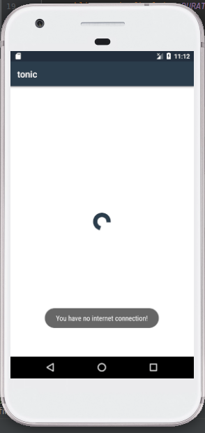
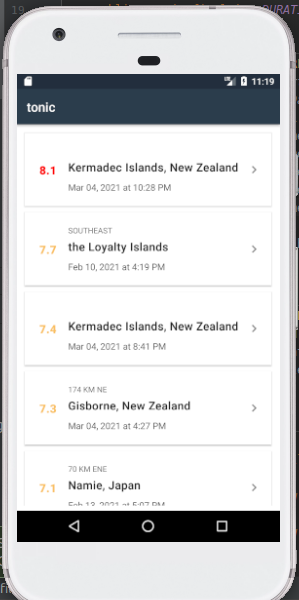
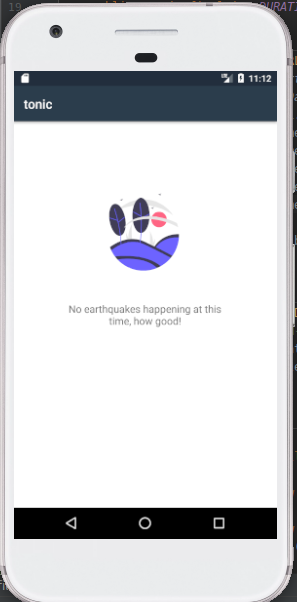

# Tonic

An Android app (Java) to learn networking in Android. It displays earthquake information by consuming the [USGS](https://earthquake.usgs.gov/fdsnws/event/1/) API to display real time earthquake data.

Min API Level: 21

## Components
- [RecyclerView](https://developer.android.com/reference/android/support/v7/widget/RecyclerView.html) - for dynamic high performance list.
- [Loaders](https://developer.android.com/guide/components/loaders) - for managing operations off the main UI thread.
- [ConstraintLayout](https://developer.android.com/reference/androidx/constraintlayout/widget/ConstraintLayout) - for creating high performing complex views

## Libraries
- [OkHttp](https://square.github.io/okhttp/) - for network requests.

## Demo
||||
